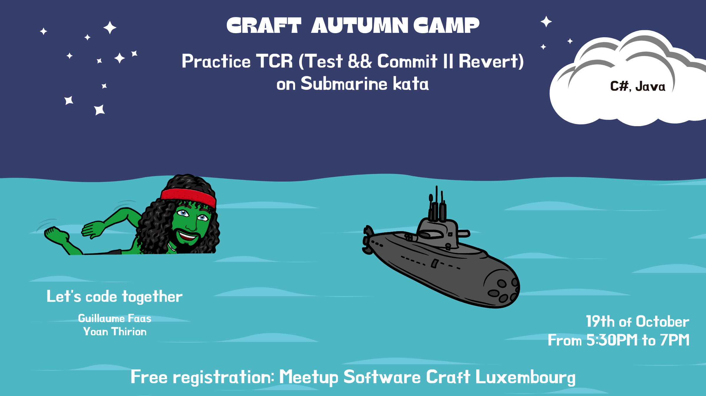

# Disclaimer

The puzzle used for this kata is taken from Advent Of Code 2021 ([Day 2 - Part 2](https://adventofcode.com/2021/day/2)).
All credits goes to AOC's team for their incredible work.

The TCR Utility Tool in this repository is Murex's one that can be found [here](https://github.com/murex/TCR).



# Kata

The goal of this kata is to allow people to get familiar with
TCR ([Test && Commit || Revert](https://medium.com/@kentbeck_7670/test-commit-revert-870bbd756864)), and experience it in a safe context as a pair or mob.

### Prerequisites

* Your favorite IDE
* SpecFlow plugin
    * [VS2022](https://marketplace.visualstudio.com/items?itemName=TechTalkSpecFlowTeam.SpecFlowForVisualStudio2022)
    * [Rider](https://plugins.jetbrains.com/plugin/15957-specflow-for-rider)
 * Cucumber plugin available [here](https://plugins.jetbrains.com/plugin/7212-cucumber-for-java)

### Story

You need to figure how to pilot this submarine.

It seems like the submarine can take a series of commands like `forward 1`, `down 2`, or `up 3`:

- `down X` **increases** your aim by `X` units.
- `up X` **decreases** your aim by `X` units.
- `forward X` does two things:
    - It increases your horizontal position by `X` units.
    - It increases your depth by your aim **multiplied by** `X`.

Note that since you're on a submarine, `down` and `up` affect your **aim** and do the opposite of what you might think.

The submarine seems to already have a planned course. You should probably figure out where it's going. For example:

- `forward 5`
- `down 5`
- `forward 8`
- `up 3`
- `down 8`
- `forward 2`

Your horizontal position, depth and aim all start at 0. The steps above would then modify them as follows:

- `forward 5` adds `5` to your horizontal position, a total of `5`.
    - Because your aim is `0`, your depth does not change.
- `down 5` adds `5` to your aim, resulting in a value of `5`.
- `forward 8` adds `8` to your horizontal position, a total of `13`.
    - Because your aim is `5`, your depth increases by `8*5=40`.
- `up 3` decreases your aim by `3`, resulting in a value of `2`.
- `down 8` adds `8` to your aim, resulting in a value of `10`.
- `forward 2` adds `2` to your horizontal position, a total of `15`.
    - Because your aim is `10`, your depth increases by `2*10=20` to a total of `60`.

After following these instructions, you would have a horizontal position of `15` and a depth of `60`.

### Goal

The goal of the kata is to make all acceptance tests pass following Test-Driven Development and using the TCR Utility
Tool.

### (SUPER) Important

Create a branch of your own so you don't push all your commits on the main branch!

### Tool
Without going too much in detail, here's a little explanation on how the TCR Utility Tool works.

The command must follow the following format, and be executed from the root directory:
- .\tcr\\**OS**\tcr.exe -b .\\**language**\ -w .\\**language**\ -l **language**

```shell
// For Java
./tcr/MacOs/tcr -b java/ -w java/ -t maven
.\tcr\Windows\tcr.exe -b .\java\ -w .\java\ -l java -t maven

// For C#
./tcr/MacOs/tcr -b csharp/ -w csharp/ -l csharp
.\tcr\Windows\tcr.exe -b .\csharp\ -w .\csharp\ -l csharp

// For typescript
./tcr/MacOs/tcr -b typescript -w typescript -t npm
.\tcr\Windows\tcr.exe -b typescript -w typescript -t npm

// For python
./tcr/MacOs/tcr -b python -w python -t pytest
.\tcr\Windows\tcr.exe -b python -w python -t pytest
```

From there, the tool will provide a set of options:
```shell
[TCR] Available Options:
[TCR]   D -> Driver role
[TCR]   N -> Navigator role
[TCR]   P -> Turn on/off git auto-push
[TCR]   Q -> Quit
[TCR]   ? -> List available options
```

It's pretty simple:
- When it's your turn to drive, pick the **Driver role** or press **D**. You will be the driver for the next 5 minutes.
- Otherwise, pick the **Navigator role** or press **N**. You will constantly pull commits and have an up-to-date codebase.

Please, make sure to follow your rotation and have only one driver at a time.

Have fun!

### Rules

- Follow the Test-Driven Development approach.
- `ISubmarine` interface cannot be changed.
- `Submarine` component should have an empty constructor.
- Handle empty/wrong input so they don't affect the state of the submarine without stopping the process.
- When an acceptance test pass, change its tag to 'Acceptance'.
- Apply [SOLID principles](https://blog.cleancoder.com/uncle-bob/2020/10/18/Solid-Relevance.html) whenever possible
- Think about design like it's production code.
- Refactor the code like it's production code.
- It **is** production code, remember?

### Advices

- Baby-steps. If you think you're going small, think smaller.
- You should have TCR generating commits often, like every few minutes.
- If you spend more too much time on an implementation, discard your changes and start with another approach.
- The submarine's behavior is detailed in the summary.
- Try to implement [pure functions](https://betterprogramming.pub/what-is-a-pure-function-3b4af9352f6f) for better
  predictability.
- Use acceptance tests to follow your progress.
